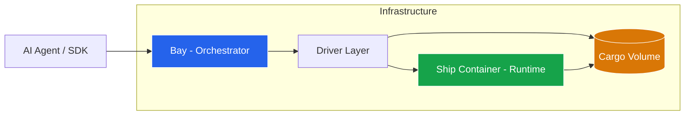
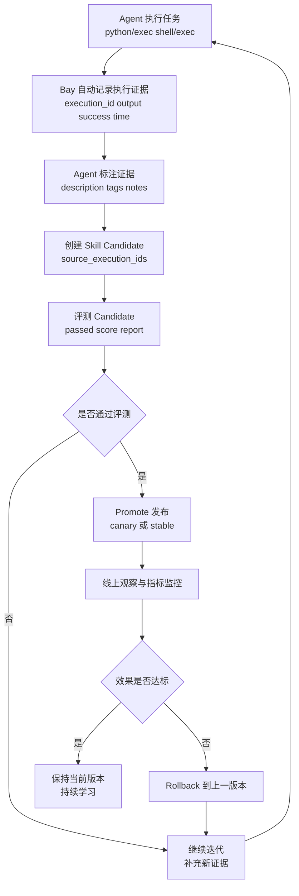

# Shipyard Neo

> **The Secure, Persistent Execution Platform for AI Agents**

Shipyard Neo 是一个专为 AI Agents 设计的安全代码执行基础设施。它提供了一个隔离的、可持久化的沙箱环境，让 Agent 能够像人类工程师一样安全地执行代码、操作文件系统和管理开发工作区。

## 🌟 核心定位

在 LLM 应用中，直接在宿主机执行生成代码极度危险且难以管理状态。Shipyard Neo 通过**计算与存储分离**的架构解决了这个问题：

*   **🛡️ 安全沙箱**：所有代码在隔离容器中运行，对宿主机零威胁。
*   **💾 持久化状态**：Cargo（数据卷）独立于计算实例，容器销毁后文件依然保留（容器内固定挂载到 `/workspace`）。
*   **⚡ 弹性计算**：按需启动计算会话（Session），空闲自动回收，高效利用资源。

## 🏗️ 架构设计

Shipyard Neo 由控制面 **Bay** 和数据面 **Ship** 组成，通过标准 HTTP 协议通信。



### 核心组件

| 组件 | 角色 | 职责 |
| :--- | :--- | :--- |
| **Bay** | 🧠 大脑 (编排层) | 负责 Sandbox 生命周期管理、鉴权、路由、资源调度。它是外部世界的唯一入口。 |
| **Ship** | 🦾 手臂 (运行时) | 运行在隔离容器内的 Agent，提供文件系统操作、IPython 内核交互和 Shell 执行能力。 |
| **Cargo** | 🗄️ 记忆 (数据层) | 持久化的 Docker Volume 或 K8s PVC，确保即使计算容器重启，项目文件和数据依然存在。 |

## ✨ 关键特性

*   **全功能 Python 环境**：内置 IPython 内核，支持变量保持、图表生成和交互式执行。
*   **真实 Shell 访问**：支持执行标准 Linux 命令，安装依赖，运行脚本。
*   **文件系统控制**：完整的上传、下载、读写、列表和删除操作。
*   **执行历史记录 (Execution History)**：自动记录 Python/Shell 执行证据，可按 `type/success/tags` 查询并打注释。
*   **技能生命周期 (Skill Lifecycle)**：支持 Candidate 创建、评测、发布（Canary/Stable）、回滚。
*   **多租户隔离**：基于 Sandbox ID 的强逻辑隔离。
*   **多驱动支持**：同时支持 Docker 和 Kubernetes 容器编排后端。
*   **Python SDK**：类型安全的异步客户端库（`shipyard-neo-sdk`），开箱即用。
*   **MCP 协议接入**：通过 MCP Server（`shipyard-neo-mcp`）让 AI Agent 原生调用沙箱能力。
*   **容器健康探测**：主动检测死容器，避免请求挂起。
*   **资源生命周期**：
    *   `TTL`：Sandbox 的存活周期。
    *   `Idle Timeout`：计算资源的空闲回收时间（省钱）。

## 📊 项目状态

> **当前阶段**：Phase 2 核心功能推进中（截至 2026-02-09：K8s Driver / Python SDK / MCP Server / Skills Lifecycle 已落地）

### ✅ 已完成 (Phase 1 Core + Phase 2 部分)

| 模块 | 状态 | 说明 |
| :--- | :--- | :--- |
| Bay 核心骨架 | ✅ 100% | Models, Managers, Drivers, REST API |
| Ship 运行时 | ✅ 100% | IPython, Shell, Filesystem, Terminal |
| 最小 E2E 链路 | ✅ 100% | create → exec → stop → delete |
| 鉴权 | ✅ 100% | API Key 认证 + Owner 隔离 |
| 幂等 | ✅ 100% | Idempotency-Key 支持 |
| Profile 能力检查 | ✅ 100% | 前置能力拦截 |
| GC 机制 | ✅ 100% | Idle Session / Expired Sandbox / Orphan Cargo（Orphan Container 默认禁用） |
| 路径安全校验 | ✅ 100% | Bay 侧路径校验 + Ship 双层防护 |
| 容器健康探测 | ✅ 100% | 主动检测死容器，避免请求挂起 |
| **K8s Driver** | ✅ 100% | Kubernetes 容器编排驱动（Pod + PVC + Pod IP 直连） |
| **Python SDK** | ✅ 100% | `shipyard-neo-sdk`，完整 Sandbox/Cargo/Capability API |
| **MCP Server** | ✅ 100% | `shipyard-neo-mcp`，AI Agent 沙箱执行的 MCP 协议接入 |
| **Execution History API** | ✅ 100% | 执行记录查询、单条读取、最近一条、注释更新 |
| **Skill Lifecycle API** | ✅ 100% | 候选创建、评测、发布、版本列表与回滚 |

### 🚧 进行中 / 待办

| 模块 | 优先级 | 说明 |
| :--- | :--- | :--- |
| **可观测性增强** | 🟡 中 | request_id 有，Prometheus metrics 未做 |
| **Ship 原生 MCP 协议层** | 🟡 中 | 与 `shipyard-neo-mcp`（独立 MCP Server）不同，此项指 Ship 内置 MCP over SSE |
| **多容器支持** | 🟡 低 | Browser + Ship Sidecar 模式 |

> 详细进度请参考 [`TODO.md`](TODO.md) 和 [`plans/phase-1/progress.md`](plans/phase-1/progress.md)

## 📂 项目结构

| 目录 | 说明 |
| :--- | :--- |
| **[`pkgs/bay`](pkgs/bay/README.md)** | **Bay 服务端**。基于 FastAPI 的编排服务，对外提供 REST API。支持 Docker 和 K8s 双驱动。 |
| **[`pkgs/ship`](pkgs/ship/README.md)** | **Ship 运行时**。构建为 Docker 镜像，作为执行环境。 |
| **[`shipyard-neo-sdk`](shipyard-neo-sdk/README.md)** | **Python SDK**。类型安全的异步客户端库（`pip install shipyard-neo-sdk`）。 |
| **[`shipyard-neo-mcp`](shipyard-neo-mcp/README.md)** | **MCP Server**。MCP 协议接入层，让 AI Agent 原生调用沙箱能力。 |
| **[`plans`](plans/)** | **设计文档**。包含架构决策、API 契约和演进路线图。 |

## 🔁 Skills Self-Update 基建

当前仓库已提供可组合的“技能自迭代”基础能力：

1. **Evidence 采集**：`/v1/sandboxes/{id}/python/exec` 与 `/shell/exec` 自动回传 `execution_id` 并持久化执行证据。  
2. **Evidence 管理**：`/v1/sandboxes/{id}/history` 提供检索、过滤、注释（`description/tags/notes`）。  
3. **Candidate 生命周期**：`/v1/skills/candidates` → `evaluate` → `promote`。  
4. **Release 运营**：`/v1/skills/releases` 支持活动版本查询与 `rollback`。  

对应调用入口：

- SDK：`sandbox.get_execution_history(...)`、`client.skills.*`
- MCP：`get_execution_history`、`create_skill_candidate`、`promote_skill_candidate` 等工具

示例流水图（从尝试到发布）：



## 📚 深度文档

### 设计与架构

*   [架构设计 (Bay Design)](plans/bay-design.md) - 深入了解系统内部原理
*   [API 契约 (Bay API)](plans/bay-api.md) - HTTP 接口定义
*   [概念模型 (Concepts)](plans/bay-concepts.md) - Sandbox, Session, Cargo 的关系

### 演进规划

*   [Phase 1 进度](plans/phase-1/phase-1.md) - 核心功能完成情况
*   [Phase 1 详细进度](plans/phase-1/progress.md) - 历史里程碑与测试覆盖追踪
*   [Skills Self-Update 落地指南](doc/skills_self_update_guide_zh.md) - 执行历史与技能生命周期的工程化接入方案
*   [GC 机制设计](plans/phase-1/gc-design.md) - 资源回收策略
*   [Phase 2 规划](plans/phase-2/phase-2.md) - 多容器与能力路由
*   [K8s Driver 分析](plans/phase-2/k8s-driver-analysis.md) - Kubernetes 驱动设计与实现
*   [SDK 设计](plans/phase-2/sdk-design.md) - Python SDK 架构设计
*   [MCP 集成设计](plans/ship-refactor-and-mcp.md) - Ship MCP 协议支持

## 🚀 快速开始

### 启动 Bay 服务

```bash
cd pkgs/bay
uv sync
uv run python -m app.main
```

### 构建 Ship 镜像

```bash
cd pkgs/ship
docker build -t ship:latest .
```

### 使用 Python SDK

```bash
pip install shipyard-neo-sdk
```

```bash
# 若尚未发布到你可访问的索引，可从源码安装
cd shipyard-neo-sdk
pip install -e .
```

```python
import asyncio
from shipyard_neo import BayClient

async def main():
    async with BayClient(
        endpoint_url="http://localhost:8000",
        access_token="your-token",
    ) as client:
        sandbox = await client.create_sandbox(profile="python-default", ttl=600)
        result = await sandbox.python.exec("print('Hello, World!')")
        print(result.output)
        await sandbox.delete()

asyncio.run(main())
```

### 使用 MCP Server

```json
{
  "mcpServers": {
    "shipyard-neo": {
      "command": "shipyard-mcp",
      "env": {
        "SHIPYARD_ENDPOINT_URL": "http://localhost:8000",
        "SHIPYARD_ACCESS_TOKEN": "your-access-token"
      }
    }
  }
}
```

```bash
# 本地源码方式启动
cd shipyard-neo-mcp
pip install -e .
shipyard-mcp
```

### 运行测试

```bash
# Bay 单元测试
cd pkgs/bay && uv run pytest tests/unit -v

# Bay E2E 测试 (Docker, docker-host 模式)
cd pkgs/bay && ./tests/scripts/docker-host/run.sh

# Bay E2E 测试 (Docker, docker-network 模式)
cd pkgs/bay && ./tests/scripts/docker-network/run.sh

# Bay K8s 测试 (需要 Kind 集群)
cd pkgs/bay && ./tests/scripts/kind/run.sh
```

请参考 [Bay README](pkgs/bay/README.md) 和 [Ship README](pkgs/ship/README.md) 了解更多细节。
