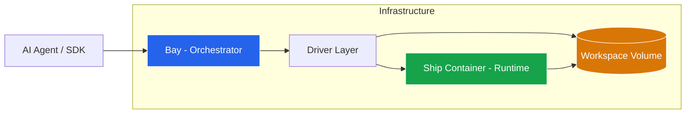

# Shipyard Neo

> **The Secure, Persistent Execution Platform for AI Agents**

Shipyard Neo 是一个专为 AI Agents 设计的安全代码执行基础设施。它提供了一个隔离的、可持久化的沙箱环境，让 Agent 能够像人类工程师一样安全地执行代码、操作文件系统和管理开发工作区。

## 🌟 核心定位

在 LLM 应用中，直接在宿主机执行生成代码极度危险且难以管理状态。Shipyard Neo 通过**计算与存储分离**的架构解决了这个问题：

*   **🛡️ 安全沙箱**：所有代码在隔离容器中运行，对宿主机零威胁。
*   **💾 持久化状态**：Workspace（工作区）独立于计算实例，容器销毁后文件依然保留。
*   **⚡ 弹性计算**：按需启动计算会话（Session），空闲自动回收，高效利用资源。

## 🏗️ 架构设计

Shipyard Neo 由控制面 **Bay** 和数据面 **Ship** 组成，通过标准 HTTP 协议通信。



### 核心组件

| 组件 | 角色 | 职责 |
| :--- | :--- | :--- |
| **Bay** | 🧠 大脑 (编排层) | 负责 Sandbox 生命周期管理、鉴权、路由、资源调度。它是外部世界的唯一入口。 |
| **Ship** | 🦾 手臂 (运行时) | 运行在隔离容器内的 Agent，提供文件系统操作、IPython 内核交互和 Shell 执行能力。 |
| **Workspace** | 🗄️ 记忆 (数据层) | 持久化的 Docker Volume 或 K8s PVC，确保即使计算容器重启，项目文件和数据依然存在。 |

## ✨ 关键特性

*   **全功能 Python 环境**：内置 IPython 内核，支持变量保持、图表生成和交互式执行。
*   **真实 Shell 访问**：支持执行标准 Linux 命令，安装依赖，运行脚本。
*   **文件系统控制**：完整的上传、下载、读写、列表和删除操作。
*   **多租户隔离**：基于 Sandbox ID 的强逻辑隔离。
*   **资源生命周期**：
    *   `TTL`：Sandbox 的存活周期。
    *   `Idle Timeout`：计算资源的空闲回收时间（省钱）。

## 📊 项目状态

> **当前阶段**：Phase 1 核心功能基本完成，进入 P1 收尾阶段

### ✅ 已完成 (Phase 1 Core)

| 模块 | 状态 | 说明 |
| :--- | :--- | :--- |
| Bay 核心骨架 | ✅ 100% | Models, Managers, Drivers, REST API |
| Ship 运行时 | ✅ 100% | IPython, Shell, Filesystem, Terminal |
| 最小 E2E 链路 | ✅ 100% | create → exec → stop → delete |
| 鉴权 | ✅ 100% | API Key 认证 + Owner 隔离 |
| 幂等 | ✅ 100% | Idempotency-Key 支持 |
| Profile 能力检查 | ✅ 100% | 前置能力拦截 |

### 🚧 进行中 (Phase 1 P1)

| 模块 | 状态 | 说明 |
| :--- | :--- | :--- |
| 路径安全校验 | ⏳ Pending | Bay 侧待实现 |
| 可观测性增强 | ⏳ Pending | request_id 有，metrics 未做 |

### 📋 待办 (Phase 2+)

| 模块 | 优先级 | 说明 |
| :--- | :--- | :--- |
| **GC 机制** | 🔴 高 | Idle Session 回收、过期 Sandbox 清理、孤儿容器检测 |
| **Workspace API** | 🟠 中 | 对外暴露独立 Workspace 管理（目前仅 managed） |
| **Extend TTL** | 🟠 中 | 支持延长 Sandbox TTL |
| **SDK 完善** | 🟠 中 | Python SDK 对接新 Bay API |
| **MCP 协议层** | 🟡 中 | Ship 支持 MCP over SSE，LLM 原生工具发现 |
| **多容器支持** | 🟡 低 | Browser + Ship Sidecar 模式 |
| **K8s Driver** | 🟡 低 | 生产级 Kubernetes 支持 |

> 详细进度请参考 [`TODO.md`](TODO.md) 和 [`plans/phase-1/progress.md`](plans/phase-1/progress.md)

## 📂 项目结构

| 目录 | 说明 |
| :--- | :--- |
| **[`pkgs/bay`](pkgs/bay/README.md)** | **Bay 服务端**。基于 FastAPI 的编排服务，对外提供 REST API。 |
| **[`pkgs/ship`](pkgs/ship/README.md)** | **Ship 运行时**。构建为 Docker 镜像，作为执行环境。 |
| **[`sdk-reference`](sdk-reference/)** | **客户端 SDK**。Python 客户端库（参考实现，待与新 API 对齐）。 |
| **[`plans`](plans/)** | **设计文档**。包含架构决策、API 契约和演进路线图。 |

## 📚 深度文档

### 设计与架构

*   [架构设计 (Bay Design)](plans/bay-design.md) - 深入了解系统内部原理
*   [API 契约 (Bay API)](plans/bay-api.md) - HTTP 接口定义
*   [概念模型 (Concepts)](plans/bay-concepts.md) - Sandbox, Session, Workspace 的关系

### 演进规划

*   [Phase 1 进度](plans/phase-1/phase-1.md) - 当前阶段完成情况
*   [GC 机制设计](plans/phase-1/gc-design.md) - 资源回收策略
*   [Phase 2 规划](plans/phase-2/phase-2.md) - 多容器与能力路由
*   [MCP 集成设计](plans/ship-refactor-and-mcp.md) - Ship MCP 协议支持

## 🚀 快速开始

### 启动 Bay 服务

```bash
cd pkgs/bay
uv sync
uv run python -m app.main
```

### 构建 Ship 镜像

```bash
cd pkgs/ship
docker build -t ship:latest .
```

### 运行测试

```bash
# Bay 单元测试
cd pkgs/bay && uv run pytest tests/unit -v

# Bay E2E 测试 (需要 Docker)
cd pkgs/bay && ./tests/scripts/docker-host/run.sh
```

请参考 [Bay README](pkgs/bay/README.md) 和 [Ship README](pkgs/ship/README.md) 了解更多细节。
