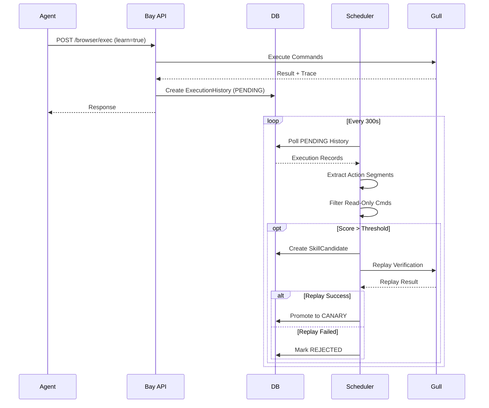
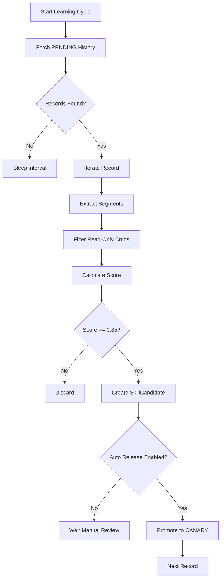
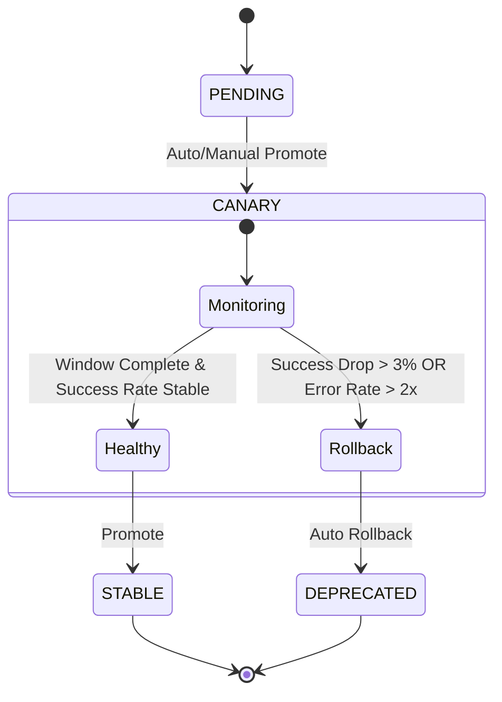

# 浏览器 Self-Update 功能介绍

本文档详细介绍了 Shipyard Neo 中的浏览器 Self-Update（自更新/自进化）机制。该机制允许系统通过观察和评估 Agent 的浏览器操作，自动提取、评分并沉淀高质量的操作模式为可重用的技能（Skill），从而实现系统的持续进化。

## 1. 概述

### 1.1 功能简介
浏览器 Self-Update 是 Shipyard Neo 的一项核心自进化能力。它通过闭环反馈机制，自动从 Agent 的日常执行中学习。当 Agent 执行浏览器任务时，系统会记录完整的执行链路（Trace），并在后台通过智能调度器对这些执行记录进行分析、评分和提炼。达到质量阈值的操作序列将被自动转化为新的技能候选（Skill Candidate），经过 Canary 金丝雀发布验证后，最终晋升为稳定技能供全系统使用。

### 1.2 设计理念
- **被动学习（Passive Learning）**：不需要 Agent 显式地"教学"，而是通过观察 Agent 的自然执行过程进行学习。
- **闭环验证（Closed-Loop Verification）**：所有学习到的技能必须经过回放验证（Replay）和金丝雀阶段（Canary）的实战检验。
- **零干扰（Zero Interference）**：学习过程在后台异步进行，不阻塞 Agent 的正常任务执行。
- **安全优先（Safety First）**：内置严格的自动回滚机制，确保新学习的技能不会破坏现有系统的稳定性。

### 1.3 核心价值
- **效率提升**：自动沉淀常用操作，减少 Agent 重复推理和规划的开销。
- **质量保证**：通过标准化的高分技能替代不确定的临场操作，提高执行成功率。
- **知识积累**：将隐性的操作知识显性化为系统资产，实现系统能力的持续积累。

## 2. 架构设计

Shipyard Neo 的 Self-Update 机制跨越了控制面（Bay）、执行面（Ship/Gull）和存储层。

```mermaid
graph TD
    subgraph "Agent Layer"
        Agent[Agent / User]
    end

    subgraph "Bay Control Plane"
        API[Capabilities API]
        History[History API]
        SkillMgr[Skills API]
        Scheduler[Browser Learning Scheduler]
    end

    subgraph "Data Storage"
        DB[(PostgreSQL)]
        Blob[Artifact Storage]
    end

    subgraph "Runtime Environment"
        Ship[Ship (Code Execution)]
        Gull[Gull (Browser Runtime)]
    end

    Agent -->|POST /browser/exec| API
    API -->|Execute Cmd| Gull
    Gull -->|Result & Trace| API
    API -->|Save History| DB
    
    Scheduler -->|Poll Pending| DB
    Scheduler -->|Analyze & Extract| DB
    Scheduler -->|Replay & Verify| Gull
    Scheduler -->|Promote| SkillMgr
    SkillMgr -->|Update Spec| DB
```

### 核心组件说明
- **Agent Layer**：任务的发起者，负责生成浏览器操作指令。
- **Bay Control Plane**：
    - **Capabilities API**：接收执行请求，协调运行时。
    - **Browser Learning Scheduler**：后台核心调度器，负责从历史记录中挖掘技能。
- **Runtime Environment**：
    - **Gull**：浏览器运行时，负责执行实际的 CDP (Chrome DevTools Protocol) 指令并生成 Trace。
- **Data Storage**：存储执行历史、技能候选、发布状态及工件数据。

## 3. 工作原理

### 3.1 Self-Update 闭环流程

整个流程从 Agent 的执行开始，经过后台的异步处理，最终形成新的技能。



### 3.2 学习处理流程

调度器内部的处理逻辑如下：



### 3.3 Canary 生命周期管理

技能发布后进入生命周期管理，系统持续监控其表现。



## 4. 核心概念

| 概念 | 说明 | 对应实体 |
|------|------|----------|
| **ExecutionHistory** | 浏览器操作的原始执行记录，包含输入命令、输出结果和详细的 Trace 信息。 | `ExecutionHistory` |
| **ArtifactBlob** | 存储具体的技能工件数据（如代码、配置），是技能的物理载体。 | `ArtifactBlob` |
| **SkillCandidate** | 从执行历史中提取出的潜在技能雏形，包含评分和元数据，等待审核或验证。 | `SkillCandidate` |
| **SkillRelease** | 技能的正式发布版本，具有明确的版本号和发布阶段（CANARY/STABLE）。 | `SkillRelease` |
| **SkillEvaluation** | 对技能表现的量化评估，包括成功率、耗时、错误率等指标。 | `SkillEvaluation` |

## 5. 数据模型

### 5.1 关键枚举状态

#### LearnStatus (学习状态)
用于标记 `ExecutionHistory` 的处理状态。
- `PENDING`: 等待学习处理
- `PROCESSING`: 正在处理中
- `COMPLETED`: 处理完成（已提取或忽略）
- `FAILED`: 处理失败
- `SKIPPED`: 跳过（如明确标记不学习）

#### SkillReleaseStage (发布阶段)
用于标记 `SkillRelease` 的生命周期阶段。
- `ALPHA`: 内部测试阶段
- `CANARY`: 金丝雀发布（灰度验证）
- `STABLE`: 稳定版本
- `DEPRECATED`: 已弃用
- `ROLLED_BACK`: 已回滚

#### SkillType (技能类型)
- `BROWSER_MACRO`: 浏览器宏（一系列浏览器操作的组合）
- `PYTHON_SCRIPT`: Python 脚本
- `SHELL_SCRIPT`: Shell 脚本

## 6. 技术细节

### 6.1 只读命令过滤
为了保证提取的技能具有实际的操作意义，系统会自动过滤掉纯观察类的只读命令。这些命令通常用于 Agent 获取上下文，但不构成技能的核心动作。

**被过滤的命令包括**：
- `snapshot` (页面快照)
- `get` (获取元素属性)
- `is` (状态判断)
- `wait` (等待)
- `cookies`, `storage` (状态查看)
- `network requests` (网络请求查看)
- `tab`, `frame`, `dialog` (上下文切换/查看)

### 6.2 自动评分逻辑
系统使用以下公式对提取的操作片段进行评分：

```python
# 评分公式
score = min(0.99, 0.75 + 0.08 * steps)

# 示例
# 1步操作: 0.75 + 0.08 = 0.83 (低于默认阈值 0.85)
# 2步操作: 0.75 + 0.16 = 0.91 (合格)
# 3步操作: 0.75 + 0.24 = 0.99 (满分)
```
> **注**：默认配置下（阈值 0.85），至少包含 2 个有效动作步骤的片段才会被提取为技能。

### 6.3 自动回滚触发条件
在 CANARY 阶段，系统会持续监控技能的健康状况。触发回滚的条件如下：

1.  **成功率显著下降**：
    `Current Success Rate < (Baseline - 0.03)`
    *例如：基准成功率 95%，如果当前成功率跌破 92%，则触发回滚。*

2.  **错误率倍增**：
    `Current Error Rate > (Baseline * 2.0)`
    *例如：基准错误率 1%，如果当前错误率超过 2%，则触发回滚。*

### 6.4 Trace Payload 结构
浏览器执行的 Trace 包含详细的步骤信息，用于回放和分析。

```json
{
    "kind": "browser_batch_trace",
    "steps": [
        {
            "kind": "individual_action",
            "cmd": "open https://example.com",  // 执行的命令
            "stdout": "...",                   // 标准输出
            "step_index": 0,                   // 步骤索引
            "duration_ms": 1200                // 执行耗时
        }
        // ... 更多步骤
    ],
    "success": true,
    "duration_ms": 1400
}
```

## 7. 相关文档链接

- [`doc/browser_self_update_usage_zh.md`](doc/browser_self_update_usage_zh.md): 浏览器 Self-Update 功能使用文档
- [`doc/gull_browser_runtime.md`](doc/gull_browser_runtime.md): Gull 浏览器运行时详细说明
- [`doc/agent_browser_guide.md`](doc/agent_browser_guide.md): Agent 浏览器操作指南
- [`doc/bay_api_v1.md`](doc/bay_api_v1.md): Bay API 接口文档
