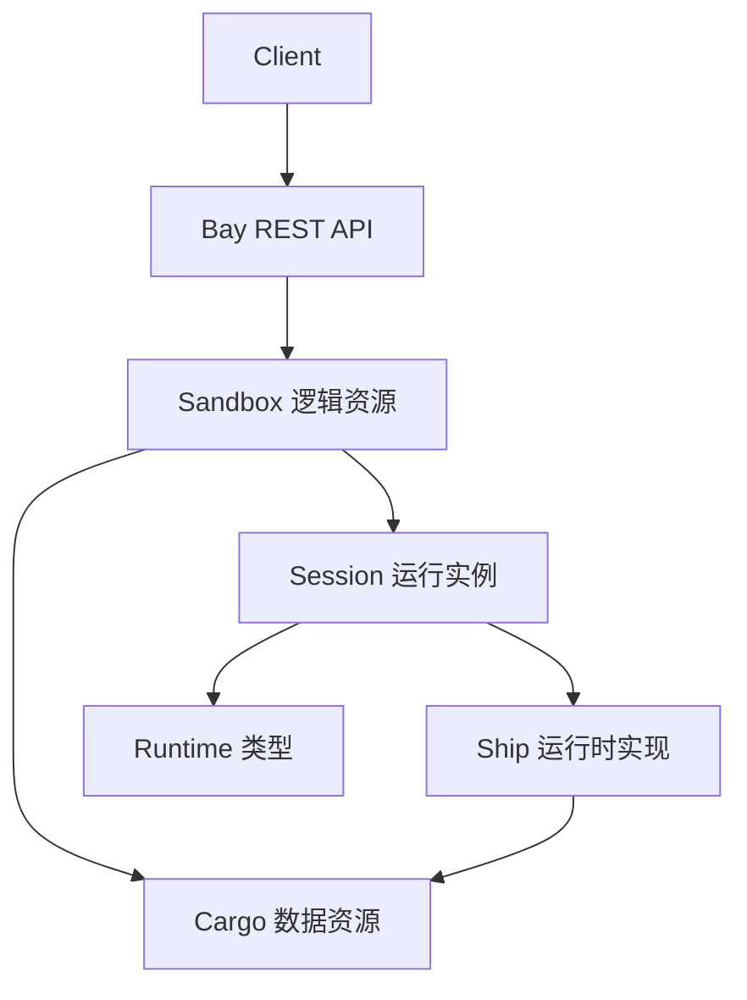

# Bay 数据概念与职责边界（草案）

> 本文用于对齐 Bay 侧“有哪些数据概念、各自管理什么、生命周期与边界在哪里”。
>
> - 架构方案参见：[plans/bay-design.md](plans/bay-design.md:1)
> - API 契约参见：[plans/bay-api.md](plans/bay-api.md:1)
>
> 关键决策：Bay 在 DB 对 Sandbox 做软删除 tombstone（保留 `deleted_at`/retention），对外 `GET /v1/sandboxes/{id}` 返回 404；用于幂等、审计，以及管理 `managed` cargo 的删除判定。

## 1. 数据概念清单（对外 vs 对内）

### 1.1 对外必需概念

- `Sandbox`
  - 对外唯一必需资源与稳定句柄：`sandbox_id`
  - 用户视角：一个可执行能力集合（filesystem/shell/python 等）+ 与之绑定的数据空间

### 1.2 对外可选概念（高级/管理面）

- `Cargo`
  - 数据面资源：用于持久化与跨运行实例共享
  - 默认普通调用方不必直接使用；可能需要更高权限 scope

### 1.3 对内概念（不对外暴露）

- `Session`
  - 运行实例：一次容器/Pod 生命周期
  - 可被 idle 回收、失败重建
- `Profile`
  - 运行时规格的有限枚举：镜像/资源/capabilities/idle_timeout
- `Runtime`
  - 运行时类型的抽象（Phase 1 默认为 Ship；未来可扩展 browser runner/gpu runner 等）

## 2. 概念关系与生命周期

- `Sandbox` 与 `Cargo`
  - 当前基调：1 sandbox : 1 cargo（降低复杂度）
  - cargo 负责数据持久化，sandbox 负责对外能力与生命周期编排

- `Sandbox` 与 `Session`
  - session 是可替换的运行实例
  - idle 回收仅回收 session，不回收 sandbox/workspace（除非 sandbox 被彻底销毁）

- `Profile`
  - profile 绑定 session 的运行时规格
  - profile 的变更对已存在 sandbox/session 的影响需要版本化或冻结策略（v1 可冻结）

## 3. Cargo 两类（managed vs external）

定义参见：[plans/bay-design.md](plans/bay-design.md:36)。

- `managed` cargo
  - 来源：由 `POST /v1/sandboxes` 隐式创建
  - 绑定：`managed_by_sandbox_id = sandbox_id`
  - 删除策略：当 `DELETE /v1/sandboxes/{id}` 触发“彻底销毁”时 **强制级联删除**（避免孤儿数据与成本泄露）

- `external` cargo
  - 来源：由 `POST /v1/cargos` 显式创建/导入
  - 删除策略：**永不**被 sandbox 的销毁动作级联删除（避免误删用户资产）

配套 API 语义参见：[plans/bay-api.md](plans/bay-api.md:1)。

## 4. Sandbox 生命周期（从用户心智出发）

语义参见：[plans/bay-design.md](plans/bay-design.md:110)。

- `ttl`：Sandbox TTL（逻辑资源硬上限）
  - 可为 `null`/`0` 表示不过期（内部/高级用户）
- `idle_timeout`：Session idle 回收（软回收）
- `keepalive`：只延长 idle，不改变 ttl

用户操作与后端动作的对应：
- 调用能力 `POST /v1/sandboxes/{id}/...`
  - Bay 执行 `ensure_running`：必要时创建/重建 session
- `POST /v1/sandboxes/{id}/stop`
  - 仅回收算力：销毁 session，保留 sandbox/workspace
- `DELETE /v1/sandboxes/{id}`
  - 彻底销毁：销毁运行实例；managed cargo 级联删除；external 不级联

## 5. 职责边界（数据归属与一致性归属）

### 5.1 Bay（source of truth）

- Bay 必须持久化 `Sandbox/Session/Cargo` 元数据（DB + ORM，支持 SQLite/MySQL/PostgreSQL）
- Bay 负责一致性与并发控制（按 sandbox 粒度串行化），以及重启恢复 reconcile

参见：[plans/bay-design.md](plans/bay-design.md:213)。

### 5.2 Driver（基础设施执行器）

- 仅负责容器/Pod 生命周期与状态查询、日志
- 不承载业务策略

参见：[plans/bay-design.md](plans/bay-design.md:169)。

### 5.3 RuntimeClient（运行时客户端）

- `CapabilityRouter`：路由与策略的统一入口（超时/重试/熔断/审计/指标/限流）
- `ShipClient`：RuntimeClient 的一个实现，纯 HTTP 客户端

参见：[plans/bay-design.md](plans/bay-design.md:274)。

## 6. v1 暂不做的事（刻意约束）

- 多 sandbox 共享同一 cargo（避免引入引用计数、并发写冲突与复杂权限）
- 对外暴露 session_id
- 引入 etcd/redis 等额外分布式依赖（先用 DB 解决一致性与幂等）
