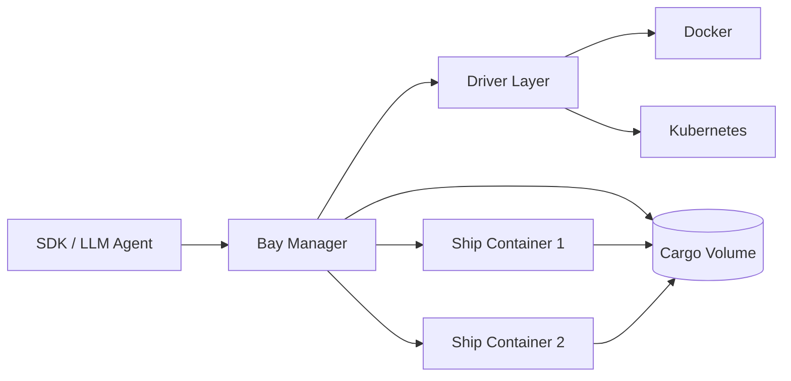

# Bay 编排层设计方案

> Bay 是 Ship 容器的编排层，负责容器生命周期管理，作为外部世界与 Ship 之间的唯一入口。

## 1. 设计目标与原则

### 1.1 核心原则

- **1 Session : 1 Container**：容器是一次性计算载体，销毁即清理
- **计算易变，数据稳定**：持久化依赖独立的 Cargo，不依赖容器
- **不直连底层容器**：外部世界只连 Bay，不直接访问 Ship 容器
- **多协议统一**：REST API 为主，后续可扩展 MCP/WebSocket

### 1.2 与 Ship 的分工

| 层级 | 职责 | 位置 |
|:--|:--|:--|
| **Bay (编排层)** | 生命周期管理、鉴权、路由、Cargo 管理 | 独立服务 |
| **Ship (运行时)** | 文件/Shell/IPython 执行能力 | 容器内 Agent |



## 2. 核心概念模型

### 2.1 Cargo（数据层 - 持久化）

- **本质**：Docker Volume / K8s PVC
- **生命周期**：长于容器、长于 Session
- **作用**：跨 Runtime/跨容器共享数据
- **关键能力**：可绕过容器直接读写（不必启动 Compute）

#### 2.1.1 统一挂载路径（强约束）

为降低路径映射复杂度、减少安全风险，约定所有运行时容器把 cargo 统一挂载到固定路径：

- `WORKSPACE_MOUNT_PATH = /workspace`
- API 与运行时能力（filesystem/shell/python）中的所有文件路径参数必须是**相对路径**（相对 `/workspace`）
- Bay 必须拒绝绝对路径与目录穿越（例如 `../`）

> 该约束同时解决[plans/bay-design.md](plans/bay-design.md:38)中“Docker Volume”与[plans/bay-design.md](plans/bay-design.md:527)配置示例 `root_path` 的潜在漂移：
> - “运行时访问路径”始终是容器内 `/workspace/...`
> - “宿主/存储后端路径”仅用于 Bay 管理与直读写实现，不暴露给运行时与客户端

> Cargo 分两类，解决“隐式创建 + 删除语义”问题：
> - `managed`：由 `POST /sandboxes` 隐式创建，默认用于该 Sandbox；当 Sandbox 被彻底销毁时可级联删除。
> - `external`：由 `POST /workspaces` 显式创建/导入；**永不**被 Sandbox 的销毁动作级联删除。

```python
# 数据模型
class Cargo:
    id: str                    # 唯一标识
    owner: str                 # 所属租户
    path: str                  # 存储路径（宿主/后端位置，不对外暴露）
    size_limit_mb: int         # 配额限制
    created_at: datetime
    last_accessed_at: datetime

    managed: bool              # 是否为 Sandbox 隐式创建
    managed_by_sandbox_id: str | None

    mount_path: str            # 容器内挂载点，固定为 /workspace
```

### 2.2 Profile（运行时规格 - 有限枚举）

- **作用**：收敛镜像规格为有限集合
- **不做**：无限自定义镜像

```python
class Profile:
    id: str                    # 如 "python-default", "python-gpu"
    image: str                 # 镜像地址
    resources: ResourceSpec    # CPU/Memory 限制
    capabilities: list[str]    # ["filesystem", "shell", "ipython"]
    idle_timeout: int          # 空闲回收时间（秒）
    env: dict[str, str]        # 默认环境变量
```

**预置 Profiles（Phase 1）**：

| Profile ID | 镜像 | 能力 | 资源 |
|:--|:--|:--|:--|
| `python-default` | `ship:latest` | filesystem, shell, ipython | 1 CPU, 1G RAM |
| `python-data` | `ship:data` | 同上 + pandas/numpy | 2 CPU, 4G RAM |

### 2.3 Session（计算实例 - 短生命周期）

- **对应**：一个容器/Pod 运行实例
- **生命周期**：可懒启动、空闲回收
- **绑定**：1 Session = 1 Container

```python
class Session:
    id: str                    # 唯一标识
    workspace_id: str          # 关联的 Cargo
    profile_id: str            # 使用的 Profile
    status: SessionStatus      # pending/starting/running/stopped/failed
    container_id: str | None   # Docker Container ID / K8s Pod Name
    endpoint: str | None       # Ship 容器的访问地址
    owner: str                 # 所属租户
    created_at: datetime
    last_active_at: datetime

class SessionStatus(Enum):
    PENDING = "pending"        # 等待创建
    STARTING = "starting"      # 容器启动中
    RUNNING = "running"        # 运行中
    STOPPING = "stopping"      # 停止中
    STOPPED = "stopped"        # 已停止
    FAILED = "failed"          # 启动失败
```

#### 2.3.1 生命周期与回收语义（TTL / idle_timeout / keepalive）

为避免 `ttl`（创建参数）、`idle_timeout`（Profile 配置）与 `keepalive`（API）语义冲突，约定如下：

- `ttl`：**Sandbox TTL（逻辑资源硬上限）**
  - 到期后 Sandbox 进入 `expired`，不可再通过 `ensure_running` 自动恢复执行能力。
  - 允许“不过期”的 Sandbox：`ttl = null` 或 `ttl = 0` 表示无限期（仅建议给内部/高级用户），但需要配额/上限与管理员清理策略兜底。
- `idle_timeout`：**Session idle 回收（软回收）**
  - 仅回收 `Sandbox.current_session`（释放算力），Sandbox 与 Cargo 仍存在。
  - 下次调用 `POST /sandboxes/{sandbox_id}/...` 时由 Bay `ensure_running` 自动重建 Session。
- `keepalive`：**仅延长 idle，不改变 ttl**
  - `POST /sandboxes/{sandbox_id}/keepalive` 只重置/延长 `idle_expires_at`（如果当前没有 session，建议不隐式启动算力）。

建议在 Sandbox 查询结果中同时返回：
- `expires_at`：Sandbox TTL 的到期时间（无限期则为 `null`）
- `idle_expires_at`：当前 Session 的 idle 到期时间（无 session 则为 `null`）

### 2.4 Sandbox（对外聚合概念）

- **对外**：用户只关心"一个 Sandbox 能干啥"，并希望有一个**稳定可引用**的 ID
- **对内**：Sandbox = Cargo + Profile + (可替换) Session + Capabilities

```python
class Sandbox:
    sandbox_id: str             # 稳定对外句柄（不等于 Session.id）
    cargo: Cargo
    profile: Profile

    # 运行实例（可被回收/重建）
    current_session: Session | None

    # 聚合属性
    @property
    def status(self) -> str: ...

    @property
    def capabilities(self) -> list[str]: ...

    @property
    def endpoint(self) -> str | None: ...
```

#### 2.4.1 对外抽象层级（ID 与可见性）

- **对外唯一必需资源：Sandbox**
  - 客户端/SDK/LLM Agent 只需要保存 `sandbox_id` 并通过它调用能力。
  - `Session` **不对外暴露**，仅作为后端运行实例；回收/重建不应破坏对外引用。
- **Cargo：可选可见资源（高级/管理面）**
  - 普通使用路径不要求调用方理解或直接操作 Cargo。
  - 若开放 Cargo API，建议作为更高权限 scope 的“数据面能力”（导入导出/离线编辑/资产管理），避免与 Sandbox 主流程耦合。

#### 2.4.2 Session 替换语义（透明恢复）

- `idle_timeout` 等策略只回收 `current_session`（释放算力），Sandbox 仍存在。
- 当调用 `POST /sandboxes/{sandbox_id}/...` 时，Bay 可执行 `ensure_running`：
  - 若 `current_session` 不存在或不就绪，则自动创建并启动新 Session，更新 `current_session` 后再转发到 Ship。

## 3. 抽象分层

### 3.1 Driver 层（基础设施抽象）

**职责**：屏蔽 Docker 与 K8s 差异，只管容器生命周期

- Driver **不承载业务策略**：不负责鉴权、回收策略、重试/熔断、审计、限流、配额等。
- Driver 仅负责把 Manager 产出的“声明式规格”落到具体后端（Docker/K8s），例如：
  - 挂载（cargo volume）、网络、labels/annotations、资源限制、环境变量等。

> 这样能保证后端可替换：更换 DockerDriver/K8sDriver 不需要把业务策略复制一遍。

```python
class Driver(ABC):
    @abstractmethod
    async def create(self, session: Session, profile: Profile, cargo: Cargo) -> str:
        """创建容器，返回 container_id"""
    
    @abstractmethod
    async def start(self, container_id: str) -> str:
        """启动容器，返回 endpoint"""
    
    @abstractmethod
    async def stop(self, container_id: str) -> None:
        """停止容器"""
    
    @abstractmethod
    async def destroy(self, container_id: str) -> None:
        """销毁容器"""
    
    @abstractmethod
    async def status(self, container_id: str) -> ContainerStatus:
        """获取容器状态"""
    
    @abstractmethod
    async def logs(self, container_id: str, tail: int = 100) -> str:
        """获取容器日志"""


class DockerDriver(Driver):
    """Docker 实现"""
    
class K8sDriver(Driver):
    """Kubernetes 实现 (Phase 2)"""
```

### 3.2 Manager 层（核心管理面）

**职责**：

- 鉴权、Owner/租户隔离
- Session 生命周期（懒启动、Keepalive、空闲回收）
- Cargo 管理（创建、配额、直接文件操作）
- Capability Router（把请求路由到对应 Ship）
- 安全策略
- **元数据存储与一致性（关键）**：保证 Bay 重启/并发/失败下的幂等与可恢复

#### 3.2.1 元数据存储（DB）与 ORM 适配

- Bay 需要一个数据库作为 **source of truth** 来持久化 `Sandbox/Session/Cargo` 元数据（状态、关联关系、版本号等）。
- 目标：Phase 1/2 统一使用 ORM 抽象，支持 **SQLite / MySQL / PostgreSQL** 三种后端；暂不引入 etcd/redis 这类分布式组件。

#### 3.2.2 一致性与并发控制原则

- **按 Sandbox 粒度串行化**：所有会改变 `sandbox.current_session`、Session 状态的操作必须在同一 `sandbox_id` 维度加锁/串行化。
  - 实现方式：数据库行锁（`SELECT ... FOR UPDATE`）或乐观锁（`version` 字段 CAS 更新）。
- **区分 desired_state 与 observed_state**：
  - desired_state：Bay 希望的目标状态（例如 RUNNING/STOPPED）
  - observed_state：Driver/探针最后一次观测到的真实状态 + `last_observed_at`
- **幂等优先**：
  - `POST /sandboxes` 支持 `Idempotency-Key`，避免重试导致重复创建。
  - `ensure_running` 需要保证并发调用不会创建多个 Session。

#### 3.2.3 资源标记与重启恢复（reconcile）

- 强制要求 Driver 创建的容器/卷（或 K8s 资源）携带 label/annotation：`owner, sandbox_id, session_id, workspace_id, profile_id`，用于诊断与对账。
- Bay 重启后应执行一次 reconcile：
  - 用 DB 元数据与 Driver 实际资源对账，收敛 `observed_state`；
  - 识别并回收孤儿容器/孤儿卷（采取保守策略，避免误删）。

```python
class SessionManager:
    async def create_session(self, owner: str, profile_id: str, workspace_id: str | None) -> Session: ...
    async def get_session(self, session_id: str, owner: str) -> Session: ...
    async def ensure_running(self, session_id: str) -> Session: ...
    async def stop_session(self, session_id: str) -> None: ...
    async def destroy_session(self, session_id: str) -> None: ...
    async def list_sessions(self, owner: str) -> list[Session]: ...
    async def keepalive(self, session_id: str) -> None: ...


class CargoManager:
    async def create_workspace(self, owner: str) -> Cargo: ...
    async def get_workspace(self, workspace_id: str, owner: str) -> Cargo: ...
    async def delete_workspace(self, workspace_id: str) -> None: ...
    async def list_workspaces(self, owner: str) -> list[Cargo]: ...
    # 直接文件操作（不经过 Ship）
    async def read_file(self, workspace_id: str, path: str) -> bytes: ...
    async def write_file(self, workspace_id: str, path: str, content: bytes) -> None: ...
    async def list_files(self, workspace_id: str, path: str) -> list[FileInfo]: ...


class CapabilityRouter:
    """将能力请求路由到对应的 Ship 容器"""
    async def execute(self, session_id: str, capability: str, operation: str, payload: dict) -> dict: ...
```

#### 3.2.4 Capability 路由与运行时客户端分层（面向多运行时扩展）

- **CapabilityRouter**：对内的“能力网关”，负责：
  - `sandbox_id` → 解析当前运行实例（一个或多个 Session）→ 选择目标运行时与 endpoint
  - 策略：超时、重试、熔断、审计、指标、限流
  - 与 `ensure_running` 协作：必要时触发启动/重建
- **ShipClient**：仅作为 CapabilityRouter 的内部依赖之一，定位为**纯 HTTP 客户端**（序列化/反序列化、基础错误映射），不直接承载业务策略。
- 为了未来支持除 Ship 之外的运行时（例如 browser runner、gpu runner 等），建议把客户端抽象成 `RuntimeClient` 接口：
  - `ShipClient` 只是其中一个实现；Router 按 Session 的运行时类型选择对应 client。

### 3.3 接入层（多协议入口）

**Phase 1**：
- RESTful API：管理与执行

**Phase 2**：
- WebSocket：终端、日志流
- MCP SSE/WebSocket：对接 LLM Agent

## 4. REST API 设计

### 4.1 Sandbox API（对外主接口）

| 方法 | 路径 | 描述 |
|:--|:--|:--|
| `POST` | `/sandboxes` | 创建 Sandbox（隐式创建 Cargo；可懒启动 Session） |
| `GET` | `/sandboxes` | 列出当前用户的 Sandboxes |
| `GET` | `/sandboxes/{id}` | 获取 Sandbox 详情（`id` = `sandbox_id`） |
| `POST` | `/sandboxes/{id}/keepalive` | 保持活跃，重置空闲计时（建议不隐式启动算力） |
| `POST` | `/sandboxes/{id}/stop` | 仅回收算力：停止并销毁当前运行实例（Session），保留 Sandbox/Cargo |
| `DELETE` | `/sandboxes/{id}` | 彻底销毁 Sandbox：销毁所有运行实例；若 Cargo 为 `managed` 则**级联删除**，`external` 永不级联删除 |

> 约定：对外只暴露 `sandbox_id`，不暴露 `session_id`。能力调用 `POST /sandboxes/{id}/...` 时由 Bay 负责 `ensure_running`，必要时自动重建后端 Session。

**创建 Sandbox 请求**：
```json
{
  "profile": "python-default",    // 可选，默认 python-default
  "workspace_id": null,           // 可选，为空则自动创建
  "ttl": 3600                     // 可选，Sandbox TTL（秒）；null 或 0 表示不过期
}
```

**Sandbox 响应**：
```json
{
  "id": "sandbox-abc123",
  "status": "running",
  "profile": "python-default",
  "workspace_id": "ws-xyz789",
  "capabilities": ["filesystem", "shell", "ipython"],
  "created_at": "2026-01-28T06:00:00Z",
  "expires_at": "2026-01-28T07:00:00Z",
  "idle_expires_at": "2026-01-28T06:30:00Z"
}
```

### 4.2 Capability API（执行能力）

通过 Sandbox ID 路由到对应 Ship：

| 方法 | 路径 | 描述 |
|:--|:--|:--|
| `POST` | `/sandboxes/{id}/files/read` | 读取文件 |
| `POST` | `/sandboxes/{id}/files/write` | 写入文件 |
| `POST` | `/sandboxes/{id}/files/list` | 列目录 |
| `POST` | `/sandboxes/{id}/files/delete` | 删除文件 |
| `POST` | `/sandboxes/{id}/shell/exec` | 执行 Shell 命令 |
| `POST` | `/sandboxes/{id}/python/exec` | 执行 Python 代码 |
| `GET` | `/sandboxes/{id}/shell/processes` | 列出后台进程 |

### 4.3 Cargo API（可选暴露）

> 建议定位为高级/管理面能力：普通 SDK/LLM Agent 不必使用；如对外开放，应通过更高权限 scope 控制，并明确与 Sandbox 文件读写的冲突与审计策略。
>
> 生命周期规则：
> - `managed` cargo：由 `POST /sandboxes` 隐式创建；当 `DELETE /sandboxes/{id}` 触发彻底销毁时级联删除。
> - `external` cargo：显式创建/导入；永不被 sandbox 销毁动作级联删除。

| 方法 | 路径 | 描述 |
|:--|:--|:--|
| `POST` | `/workspaces` | 创建独立 Cargo |
| `GET` | `/workspaces` | 列出 Cargos |
| `GET` | `/workspaces/{id}` | 获取 Cargo 详情 |
| `DELETE` | `/workspaces/{id}` | 删除 Cargo |
| `POST` | `/workspaces/{id}/files/read` | 直接读文件（不启动容器） |
| `POST` | `/workspaces/{id}/files/write` | 直接写文件（不启动容器） |

### 4.4 管理 API

| 方法 | 路径 | 描述 |
|:--|:--|:--|
| `GET` | `/profiles` | 列出可用 Profiles |
| `GET` | `/health` | 健康检查 |
| `GET` | `/stats` | 系统统计信息 |

## 5. 安全策略

### 5.1 鉴权

- 所有请求需携带 `Authorization: Bearer <token>`
- Token 解析获取 `owner` 标识
- 资源访问校验 owner 归属

### 5.2 隔离

- **计算隔离**：1 Session = 1 Container
- **存储隔离**：每个 Cargo 独立 Volume
- **网络隔离**：Docker Network / K8s NetworkPolicy
- **资源限制**：cgroups limits + pids-limit

### 5.3 安全规则

- URL 黑名单：阻断 `169.254.*`（云元数据）、内网地址
- 命令审计：记录所有执行的命令
- 文件大小限制：单文件上限
- 执行超时：默认 5 分钟

## 6. 项目结构

> Phase 1 目标：快速落地 DockerDriver + SQLModel/Alembic + `/v1` API 最小闭环，并为多运行时与多部署形态留出扩展点。
>
> 详细执行计划见：[plans/bay-implementation-path.md](plans/bay-implementation-path.md:1)。

```
pkgs/bay/
├── pyproject.toml
├── README.md
├── Dockerfile
├── bay/
│   ├── __init__.py
│   ├── main.py                    # FastAPI 入口（注册 /v1 路由）
│   ├── config.py                  # 配置管理（DB DSN、driver、镜像、sock 等）
│   ├── db/
│   │   ├── __init__.py
│   │   ├── session.py             # SQLModel engine/session
│   │   └── migrations/            # Alembic migrations
│   ├── models/
│   │   ├── __init__.py
│   │   ├── sandbox.py             # SQLModel: sandboxes（含 tombstone）
│   │   ├── cargo.py           # SQLModel: workspaces（managed/external）
│   │   ├── session.py             # SQLModel: sessions（desired/observed）
│   │   └── idempotency.py         # SQLModel: idempotency_keys
│   ├── drivers/
│   │   ├── __init__.py
│   │   ├── base.py                # Driver 抽象基类
│   │   ├── docker.py              # Docker 实现（支持 sock in-container/host）
│   │   └── k8s.py                 # K8s 实现 (Phase 2)
│   ├── managers/
│   │   ├── __init__.py
│   │   ├── sandbox.py             # Sandbox 生命周期（stop/delete/ttl）
│   │   ├── session.py             # ensure_running + idle 回收 + meta 握手
│   │   └── cargo.py           # Docker Volume backend + 软配额
│   ├── router/
│   │   ├── __init__.py
│   │   └── capability.py          # CapabilityRouter（策略 + 路由）
│   ├── api/
│   │   ├── __init__.py
│   │   ├── v1/
│   │   │   ├── __init__.py
│   │   │   ├── sandboxes.py       # /v1/sandboxes + keepalive + stop
│   │   │   ├── capabilities.py    # /v1/sandboxes/{id}/*
│   │   │   ├── workspaces.py      # /v1/workspaces（可 feature-flag）
│   │   │   └── profiles.py        # /v1/profiles
│   │   └── admin.py               # 管理 API（可选）
│   ├── auth/
│   │   ├── __init__.py
│   │   └── jwt.py                 # JWT 鉴权（Phase 1 可简化）
│   └── clients/
│       ├── __init__.py
│       ├── runtime.py             # RuntimeClient 抽象
│       └── ship.py                # ShipClient（调用 /meta + 能力 endpoints）
└── tests/
    ├── __init__.py
    ├── conftest.py
    ├── unit/
    └── integration/
```

## 7. 实施路线图

### Phase 1: 核心功能 (MVP)

- [ ] 项目骨架搭建（FastAPI + 依赖）
- [ ] 模型定义（Cargo, Profile, Session, Sandbox）
- [ ] Docker Driver 实现
- [ ] Session Manager 实现
- [ ] Cargo Manager 实现（基于 Docker Volume）
- [ ] Ship HTTP Client（调用 Ship REST API）
- [ ] Sandbox API 实现
- [ ] 基础鉴权（JWT）
- [ ] 单元测试 + 集成测试

### Phase 2: 生产就绪

- [ ] 空闲回收机制（Idle Timeout）
- [ ] Keepalive 机制
- [ ] 配额管理
- [ ] 审计日志
- [ ] Kubernetes Driver
- [ ] 监控指标（Prometheus）

### Phase 3: 协议扩展

- [ ] WebSocket 终端代理
- [ ] MCP 接入层
- [ ] 日志流

### Phase 4: 能力扩展

- [ ] Browser Profile（Playwright）
- [ ] 多 Cargo 共享

## 8. 与 Ship 的交互

> Ship 是 Phase 1 的默认运行时。Bay 内部通过 CapabilityRouter 统一承载策略与路由；ShipClient 定位为其内部的纯 HTTP 客户端实现之一（见[plans/bay-design.md](plans/bay-design.md:244)）。

### 8.1 运行时自描述接口（GET /meta）

为让 `Profile.capabilities`（见[plans/bay-design.md](plans/bay-design.md:75)）与运行时真实能力形成可验证契约，Ship 需提供运行时自描述接口：

- `GET /meta`
- 用途：
  - Bay 在 `ensure_running` 后对运行时做握手校验（runtime name/version/api version/capabilities）
  - 作为运行时兼容性与诊断信息来源

响应示例：
```json
{
  "runtime": {
    "name": "ship",
    "version": "1.0.0",
    "api_version": "v1",
    "build": {
      "image": "ship:default",
      "image_digest": "sha256:...",
      "git_sha": "..."
    }
  },
  "cargo": {
    "mount_path": "/workspace"
  },
  "capabilities": {
    "filesystem": {
      "operations": ["read", "write", "list", "delete"],
      "path_mode": "relative_to_mount"
    },
    "shell": {
      "operations": ["exec", "processes"]
    },
    "python": {
      "operations": ["exec"],
      "engine": "ipython"
    }
  }
}
```

> 约束：capabilities 的 key 与 Bay 的 capability 路由名保持稳定映射；若某 capability 不存在，Bay 不应在 Profile 中宣称支持。

### 8.2 默认镜像策略（default image）

为降低 `ship:latest` 漂移带来的兼容风险，建议：

- 提供一个“默认镜像”tag（例如 `ship:default`），并在发布流程中保证其与 Bay 期望的 API 契约兼容。
- Profile 中尽量使用可追溯的 tag 或 digest（`image_digest`）用于定位问题与回滚。

Bay 通过 HTTP 调用 Ship 的 REST API：

```python
class ShipClient:
    def __init__(self, base_url: str):
        self.base_url = base_url
    
    async def read_file(self, path: str) -> dict:
        return await self._post("/fs/read_file", {"path": path})
    
    async def write_file(self, path: str, content: str) -> dict:
        return await self._post("/fs/write_file", {"path": path, "content": content})
    
    async def exec_shell(self, command: str, **kwargs) -> dict:
        return await self._post("/shell/exec", {"command": command, **kwargs})
    
    async def exec_python(self, code: str, timeout: int = 30) -> dict:
        return await self._post("/ipython/exec", {"code": code, "timeout": timeout})
    
    async def health(self) -> dict:
        return await self._get("/health")
```

## 9. 配置示例

```yaml
# bay/config.yaml
server:
  host: 0.0.0.0
  port: 8000

driver:
  type: docker  # docker | k8s
  docker:
    socket: unix:///var/run/docker.sock
    network: bay-network

profiles:
  - id: python-default
    image: ship:latest
    resources:
      cpus: 1
      memory: 1g
    capabilities:
      - filesystem
      - shell
      - ipython
    idle_timeout: 1800  # 30 分钟

cargo:
  root_path: /var/lib/bay/workspaces
  default_size_limit_mb: 1024

security:
  jwt_secret: ${JWT_SECRET}
  blocked_hosts:
    - 169.254.0.0/16
    - 10.0.0.0/8
    - 172.16.0.0/12
    - 192.168.0.0/16
```

## 10. 错误模型

```python
class BayError(Exception):
    code: str
    message: str
    status_code: int

class NotFoundError(BayError):        # 404
class UnauthorizedError(BayError):    # 401
class ForbiddenError(BayError):       # 403
class QuotaExceededError(BayError):   # 429
class SessionNotReadyError(BayError): # 503
class TimeoutError(BayError):         # 504
class ShipError(BayError):            # 502 (Ship 返回错误)
```
