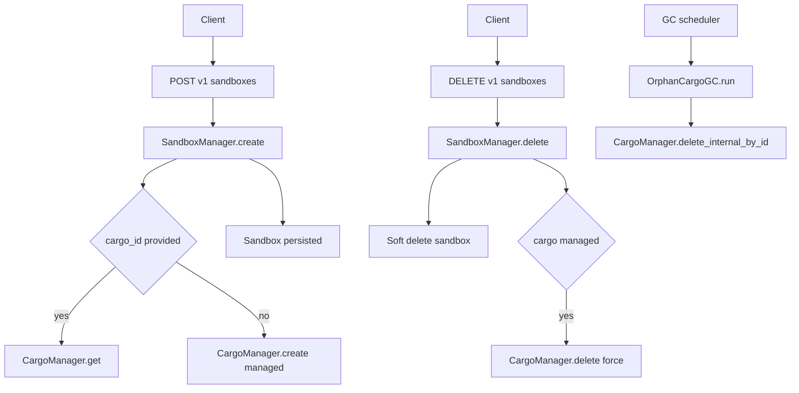

# Phase 1.5 - Cargo API 实现说明

目标：在现有内部能力（[`CargoManager`](../../pkgs/bay/app/managers/cargo/cargo.py:1) + sandbox 级联 + [`OrphanCargoGC`](../../pkgs/bay/app/services/gc/tasks/orphan_cargo.py:1)）之上，补齐对外 `/v1/cargos` 管理面 API。

该文档用于：
- 固化需要敲定的语义
- 给 Code 模式提供可直接执行的实现步骤与修改点
- 明确与现有实现的契合点/需要调整点

---

## 1. 现状基线（已存在能力）

- Cargo 模型：[`Cargo`](../../pkgs/bay/app/models/cargo.py:1)
- Cargo 内部管理：[`CargoManager`](../../pkgs/bay/app/managers/cargo/cargo.py:1)
  - `create/get/list/delete/touch/delete_internal_by_id` 已实现
- Sandbox 创建时可复用 external cargo（owner 校验由 [`CargoManager.get()`](../../pkgs/bay/app/managers/cargo/cargo.py:1) 提供）：[`SandboxManager.create()`](../../pkgs/bay/app/managers/sandbox/sandbox.py:1)
- Sandbox 删除时软删并级联删除 managed cargo（内部 `force=True`）：[`SandboxManager.delete()`](../../pkgs/bay/app/managers/sandbox/sandbox.py:1)
- Orphan managed cargo 的补偿清理：[`OrphanCargoGC`](../../pkgs/bay/app/services/gc/tasks/orphan_cargo.py:1)

---

## 2. 已敲定的语义（会议结论）

- D1: 选 B。`GET /v1/cargos` 默认只返回 external（`managed=false`），显式传 `managed=true` 才能看到 managed。
- D2: 选 B。`DELETE /v1/cargos/{id}` 对 managed cargo：若 `managed_by_sandbox_id` 对应 sandbox 已软删（[`Sandbox.deleted_at`](../../pkgs/bay/app/models/sandbox.py:1) 非空）则允许删除，否则返回 409。
- D3: 选 A。external cargo 若仍被活跃 sandbox 引用（`Sandbox.deleted_at IS NULL`），返回 409，并返回 `active_sandbox_ids`。
- D4: 选 A。`POST /v1/cargos` 支持 `Idempotency-Key`，复用 [`IdempotencyService`](../../pkgs/bay/app/services/idempotency.py:1) 的 check/save 模式。
- D5: `size_limit_mb` 允许 null/不填表示默认；若提供必须是整数，范围 1..65536，否则返回 422（Pydantic 校验）。

## 3. 待敲定的问题（如有新增再补）

---

## 4. 拟定 API 形态（与 Phase 1 设计稿对齐）

### 3.1 端点

- `POST /v1/cargos` 创建 external cargo
- `GET /v1/cargos` 列表
- `GET /v1/cargos/{id}` 详情
- `DELETE /v1/cargos/{id}` 删除

### 3.2 响应模型（不暴露 owner）

字段来源：[`Cargo`](../../pkgs/bay/app/models/cargo.py:1)

```json
{
  "id": "ws-abc123",
  "managed": false,
  "managed_by_sandbox_id": null,
  "backend": "docker_volume",
  "size_limit_mb": 1024,
  "created_at": "2026-01-30T07:00:00Z",
  "last_accessed_at": "2026-01-30T07:00:00Z"
}
```

---

## 5. 需要新增与修改的代码点（实现清单）

> 本节是 Code 模式的执行指南。

### 4.1 新增：Cargo API Router

- 新增文件：[`pkgs/bay/app/api/v1/cargos.py`](../../pkgs/bay/app/api/v1/cargos.py:1)
  - 定义 request/response pydantic models
  - 端点实现调用 [`CargoManager`](../../pkgs/bay/app/managers/cargo/cargo.py:1)
  - 复用 [`AuthDep`](../../pkgs/bay/app/api/dependencies.py:114)
  - 若决定支持幂等：复用 [`IdempotencyServiceDep`](../../pkgs/bay/app/api/dependencies.py:113)

### 4.2 修改：v1 router 注册

- 在 [`pkgs/bay/app/api/v1/__init__.py`](../../pkgs/bay/app/api/v1/__init__.py:1)
  - `include_router(cargos_router, prefix='/cargos', tags=['cargos'])`

### 4.3 修改：依赖注入

- 在 [`pkgs/bay/app/api/dependencies.py`](../../pkgs/bay/app/api/dependencies.py:1)
  - 增加 `get_cargo_manager()`
  - 增加 `CargoManagerDep`

### 4.4 修改：CargoManager.list 增加 managed 过滤

- 修改 [`CargoManager.list()`](../../pkgs/bay/app/managers/cargo/cargo.py:1)
  - 新增参数 `managed: bool | None = None`
  - 当 `managed is not None` 增加 where 条件

### 5.5 修改：CargoManager.delete 增加 external 引用检查 + managed 删除放行

- 修改 [`CargoManager.delete()`](../../pkgs/bay/app/managers/cargo/cargo.py:1)
  - 对 `managed=False` 的 cargo
    - 查询活跃 sandbox 引用：`Sandbox.cargo_id == cargo_id AND Sandbox.deleted_at IS NULL`
      - 模型字段：[`Sandbox.cargo_id`](../../pkgs/bay/app/models/sandbox.py:1)、[`Sandbox.deleted_at`](../../pkgs/bay/app/models/sandbox.py:1)
    - 若存在 → 抛 [`ConflictError`](../../pkgs/bay/app/errors.py:110) 并带 details（包括 `active_sandbox_ids`）
  - 对 `managed=True` 的 cargo
    - 如果 `force=True`：保留现有行为（内部级联删除）
    - 如果 `force=False`：按 D2
      - 若 `managed_by_sandbox_id` 为空：视为 orphan，允许删除（与 [`OrphanCargoGC`](../../pkgs/bay/app/services/gc/tasks/orphan_cargo.py:1) 的目标一致）
      - 若对应 sandbox 不存在或 `deleted_at` 非空：允许删除
      - 否则：返回 409 conflict

---

## 6. 关键流程（Mermaid）



---

## 7. 测试与验收（建议）

### 7.1 集成测试用例（面向 API）

- `POST /v1/cargos` 创建 external cargo
- `POST /v1/sandboxes` 绑定 external cargo 成功
- `DELETE /v1/cargos/{id}` 当仍被活跃 sandbox 引用 → 409（D3 选 A）
- `GET /v1/cargos` 分页 + `managed` 过滤（D1 决策后）
- `DELETE /v1/cargos/{id}` 对 managed cargo 行为（D2 决策后）

### 7.2 集成测试用例（考虑 GC 相关的竞态与补偿）

目的：覆盖“删除路径 + GC 清理”的真实世界交互，避免实现仅在理想路径下正确。

- 用例 A：managed cargo 在 sandbox 软删后可通过 `/v1/cargos` 删除（D2）
  - 创建 sandbox（生成 managed workspace）
  - 删除 sandbox（软删）
  - 立即调用 `DELETE /v1/cargos/{managed_cargo_id}`
  - 期望：204（允许删除）
  - 并验证：后续 GC 运行时不会报错（即使重复清理应保持幂等；依赖 `delete_internal_by_id` 的幂等语义）

- 用例 B：sandbox 删除级联与 GC 并发清理同一 workspace 的幂等性
  - 触发 sandbox 删除（内部会尝试 `force=True` 级联删 workspace）
  - 同时/紧接着触发 GC 扫描（或直接调用 [`OrphanCargoGC.run()`](../../pkgs/bay/app/services/gc/tasks/orphan_cargo.py:1)）
  - 期望：
    - 过程不出现未捕获异常
    - 最终 workspace 记录与 volume 均被清理（或保持一致的“已删除”状态）

- 用例 C：external cargo 的删除保护在 GC 存在时依旧成立
  - 创建 external cargo
  - 创建活跃 sandbox 引用该 cargo
  - 运行 GC（不应影响 external cargo）
  - 尝试删除 cargo
  - 期望：409 + `active_sandbox_ids`

### 7.3 与 GC 的一致性验收

- 删除 sandbox 后，即使 managed cargo 未被成功级联删除（模拟失败），GC 仍可清理 orphan（依赖 [`OrphanCargoGC`](../../pkgs/bay/app/services/gc/tasks/orphan_cargo.py:1)）

---

## 8. 结论（当前版本）

本阶段实现按上文 D1-D5 结论执行即可。
