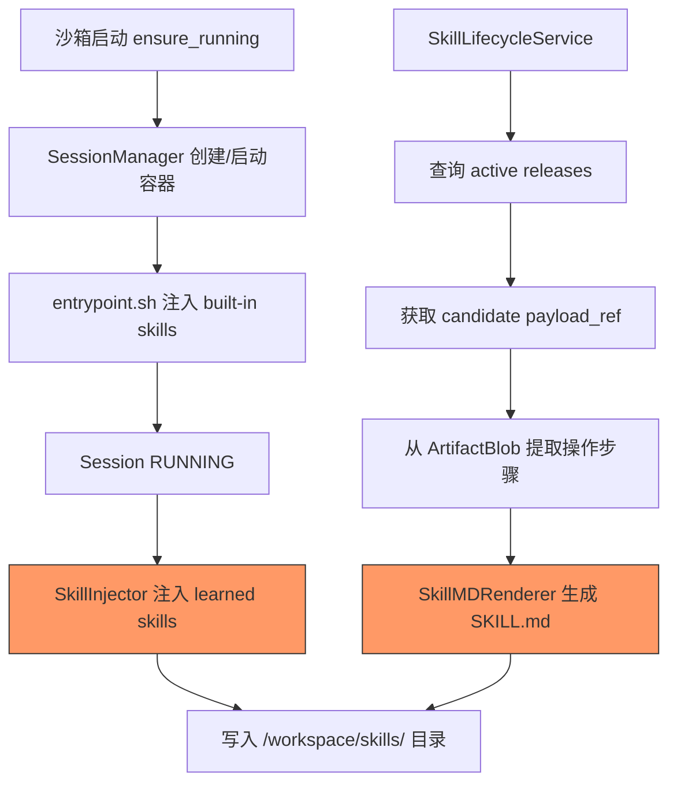
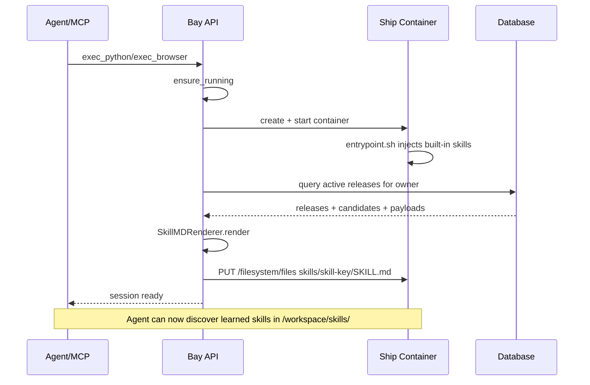

# 设计方案：Skill Candidate 注入到 /workspace/skills/

## 1. 背景与动机

当前 Shipyard Neo 存在两套并行但未打通的 skill 机制：

1. **Built-in Skills**：Ship 容器 `entrypoint.sh` 在启动时将预置 skills 注入 `/workspace/skills/<skill_name>/SKILL.md`
2. **Skill Candidates 控制平面**：通过 DB 存储执行证据链（execution → candidate → evaluation → release），Agent 可通过 API 查询和重放

两者之间缺乏桥梁。Agent 在沙箱内无法"看到"控制平面中学到的 skills，必须通过 MCP 工具链手动查询。

**目标**：将 active skill releases 在沙箱启动时自动生成 SKILL.md 格式写入 `/workspace/skills/`，使 Agent 能像使用预置 skills 一样发现和使用学到的 skills。

## 2. 架构概览



## 3. 注入时机分析

### 方案 A：在 Bay 层 ensure_running 之后注入（推荐）

在 `SandboxManager.ensure_running()` 返回 running session 后，通过 Ship 的 filesystem API 写入 SKILL.md。

**优点**：
- 不需要修改 Ship/Gull 容器镜像
- 利用现有的 filesystem API（`PUT /v1/sandboxes/{id}/filesystem/files`）
- 与 built-in skills 注入完全兼容（built-in 由 entrypoint.sh 处理，learned 由 Bay 处理）
- custom skills 不受影响（只写入 learned skills 的目录）

**缺点**：
- 首次执行时会有少量额外延迟（写入几个文件）
- 需要在 ensure_running 的热路径上增加逻辑

### 方案 B：懒加载，首次执行时注入

在首次调用 exec 类 API 时检查并注入。

**缺点**：增加首次执行延迟，代码散落在多个 exec 端点。

### 方案 C：由 entrypoint.sh 从 Bay API 拉取

Ship 容器启动时主动调用 Bay API 获取 skills 列表。

**缺点**：Ship 容器需要知道 Bay 的地址和认证信息，增加耦合。

**结论**：选择**方案 A**。

## 4. 详细设计

### 4.1 新增 SkillInjector 服务

位置：`pkgs/bay/app/services/skills/injector.py`

```python
class SkillInjector:
    """注入 learned skills 到沙箱 /workspace/skills/ 目录。"""
    
    def __init__(
        self,
        skill_svc: SkillLifecycleService,
        sandbox_mgr: SandboxManager,
    ) -> None:
        self._skill_svc = skill_svc
        self._sandbox_mgr = sandbox_mgr
    
    async def inject_learned_skills(
        self,
        *,
        owner: str,
        sandbox_id: str,
        session: Session,
    ) -> int:
        """查询 owner 的 active releases，生成 SKILL.md，写入沙箱。
        
        Returns:
            注入的 skill 数量
        """
        # 1. 查询所有 active releases
        releases, total = await self._skill_svc.list_releases(
            owner=owner,
            active_only=True,
        )
        
        if not releases:
            return 0
        
        injected = 0
        for release in releases:
            try:
                # 2. 获取 candidate 和 payload
                candidate = await self._skill_svc.get_candidate(
                    owner=owner,
                    candidate_id=release.candidate_id,
                )
                payload = await self._skill_svc.get_payload_by_ref(
                    owner=owner,
                    payload_ref=candidate.payload_ref,
                )
                
                # 3. 获取源执行历史（用于生成步骤描述）
                exec_ids = [
                    eid for eid in candidate.source_execution_ids.split(",") if eid
                ]
                executions = []
                for eid in exec_ids:
                    try:
                        ex = await self._skill_svc.get_execution_by_id(
                            owner=owner, execution_id=eid
                        )
                        executions.append(ex)
                    except Exception:
                        pass
                
                # 4. 渲染 SKILL.md
                skill_md = SkillMDRenderer.render(
                    skill_key=release.skill_key,
                    release=release,
                    candidate=candidate,
                    payload=payload,
                    executions=executions,
                )
                
                # 5. 写入沙箱文件系统
                await self._write_skill_file(
                    sandbox_id=sandbox_id,
                    session=session,
                    skill_key=release.skill_key,
                    content=skill_md,
                )
                injected += 1
                
            except Exception as exc:
                logger.warning(
                    "skills.inject.failed",
                    skill_key=release.skill_key,
                    release_id=release.id,
                    error=str(exc),
                )
        
        return injected
    
    async def _write_skill_file(
        self,
        *,
        sandbox_id: str,
        session: Session,
        skill_key: str,
        content: str,
    ) -> None:
        """通过 Ship adapter 写入文件到沙箱。"""
        # 使用 ShipAdapter 直接写入
        # 路径: skills/<skill_key>/SKILL.md
        ...
```

### 4.2 SkillMDRenderer — SKILL.md 模板渲染

位置：`pkgs/bay/app/services/skills/renderer.py`

将 skill release 数据渲染为符合 skill-creator 规范的 SKILL.md 格式。支持 **混合执行 (Hybrid Execution)** 序列。

#### 4.2.1 混合执行负载结构

需要支持三种类型的步骤：`browser`, `shell`, `python`。

Payload 结构扩展：

```json
{
  "kind": "hybrid_sequence",
  "variables": {
    "username": { "type": "string", "description": "Rancher username" },
    "password": { "type": "string", "description": "Rancher password", "secret": true }
  },
  "steps": [
    {
      "type": "browser",
      "cmd": "open https://rancher.rcfortress.site/"
    },
    {
      "type": "browser",
      "cmd": "fill @e1 \"{{username}}\""
    },
    {
      "type": "python",
      "code": "print('Login step completed')"
    }
  ]
}
```

#### 4.2.2 渲染逻辑

```python
class SkillMDRenderer:
    """将 skill release 数据渲染为 SKILL.md 格式。"""
    
    @staticmethod
    def render(
        *,
        skill_key: str,
        release: SkillRelease,
        candidate: SkillCandidate,
        payload: dict | list | None,
        executions: list[ExecutionHistory],
    ) -> str:
        # 支持混合序列渲染
        if candidate.skill_type == SkillType.HYBRID:  # 新增 HYBRID 类型
             return SkillMDRenderer._render_hybrid_skill(...)
        elif candidate.skill_type == SkillType.BROWSER:
            return SkillMDRenderer._render_browser_skill(...)
        else:
            return SkillMDRenderer._render_code_skill(...)
```

生成的 SKILL.md 示例（混合类型 + 变量）：

```markdown
---
name: rancher-login-flow
description: "Hybrid automation flow for Rancher login."
metadata:
  skill_type: hybrid
  variables:
    username: 
      type: string
      description: Rancher username
    password: 
      type: string
      description: Rancher password
---

# Rancher Login Flow

Hybrid sequence combining browser automation and python checks.

## Variables

| Name | Type | Description |
|------|------|-------------|
| `username` | string | Rancher username |
| `password` | string | Rancher password |

## Workflow Steps

1. **browser**: `open https://rancher.rcfortress.site/`
2. **browser**: `fill @e1 "{{username}}"`
3. **python**: `print('Login step completed')`

## Replay

```python
execute_hybrid_skill(
    skill_key="rancher-login-flow",
    variables={
        "username": "admin",
        "password": "..."
    }
)
```
```

### 4.3 注入钩子位置

在 `SandboxManager.ensure_running()` 的 session ready 之后、返回之前：

```python
# pkgs/bay/app/managers/sandbox/sandbox.py
async def ensure_running(self, sandbox: Sandbox) -> Session:
    ...
    # Ensure session is running
    session = await self._session_mgr.ensure_running(
        session=session,
        cargo=cargo,
        profile=profile,
    )
    
    # >>> 新增：注入 learned skills <<<
    if self._skill_injector is not None:
        await self._inject_learned_skills_if_needed(
            owner=sandbox.owner,
            sandbox_id=sandbox.id,
            session=session,
        )
    
    # Update idle timeout
    ...
    return session
```

### 4.4 去重与幂等性

需要避免每次 `ensure_running` 都重复注入。策略：

1. **Session 级标记**：在 Session 模型增加 `skills_injected_at: datetime | None` 字段
2. **首次 running 时注入**：只在 session 从 non-running 变为 running 时触发注入
3. **跳过已存在的 skill**：如果 `skills/<skill_key>/SKILL.md` 已存在且版本匹配，跳过写入

### 4.5 与 Built-in Skills 的共存

| 特征 | Built-in Skills | Learned Skills |
|------|-----------------|----------------|
| 注入时机 | entrypoint.sh（容器启动） | Bay 层 ensure_running |
| 注入方式 | 文件拷贝（容器内） | filesystem API（Bay → Ship） |
| 覆盖策略 | 每次启动覆盖 built-in 目录 | 只覆盖 learned skill 目录 |
| 元数据标识 | 无特殊标记 | `metadata.source: learned` |
| 示例 | `skills/python-sandbox/` | `skills/rancher-login-and-dashboard-screenshot/` |

Built-in skills 由 entrypoint.sh 注入且命名固定（如 `python-sandbox`），learned skills 使用 `skill_key` 作为目录名。两者在 `skills/` 下并列共存，不会冲突。

## 5. 数据流



## 6. 配置

在 `config.yaml` 中增加开关：

```yaml
skill_injection:
  enabled: true           # 是否启用 learned skills 注入
  max_skills: 50          # 单个 owner 最大注入数量
  include_stages:         # 包含哪些 release 阶段
    - stable
    - canary
```

## 7. 实施步骤

- [ ] 新增 `SkillMDRenderer` 类，实现 SKILL.md 模板渲染（支持 HYBRID 类型）
- [ ] 新增 `SkillInjector` 服务，实现查询 + 渲染 + 写入逻辑
- [ ] 在 `Session` 模型增加 `skills_injected_at` 字段
- [ ] 在 `SandboxManager.ensure_running()` 中增加注入钩子
- [ ] 增加 `skill_injection` 配置项
- [ ] 编写单元测试：SkillMDRenderer 渲染正确性（Browser + Hybrid）
- [ ] 编写单元测试：SkillInjector 幂等性和错误处理
- [ ] 编写集成测试：learned skills 出现在 /workspace/skills/ 中
- [ ] 编写集成测试：与 built-in skills 共存不冲突
- [ ] 编写集成测试：session stop/resume 后 learned skills 仍可用（Cargo Volume 持久化）

## 8. 风险与缓解

| 风险 | 缓解 |
|------|------|
| 注入大量 skills 导致启动变慢 | 配置 `max_skills` 限制；异步并行写入 |
| payload_ref 指向不存在的 blob | try/except 跳过，记录 warning 日志 |
| 与 built-in skill 同名冲突 | learned skills 使用用户定义的 skill_key，几乎不会与 python-sandbox 等内置名冲突；可加前缀 `learned-` |
| 注入失败影响正常执行 | 注入逻辑包裹在 try/except 中，失败不阻塞 ensure_running |
| Session 级别标记在 cold start 后丢失 | 新 session 总会重新注入；这是预期行为 |
